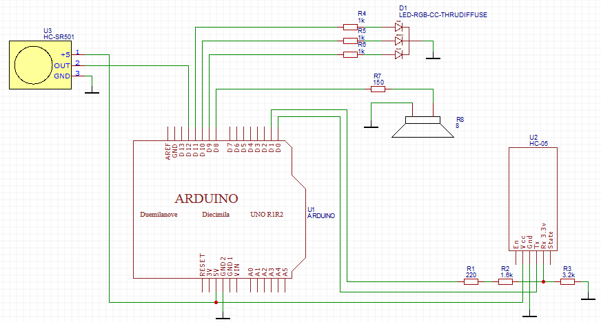

# sketch_color_recognition
Скетч Arduino для голосового управление подключёнными устройствами

## Описание
Программа управления Arduino с помощью Android-устройств через модуль Bluetooth HC-05. К Arduino подключены два исполнительных
механизма (RGB-светодиод и динамик) и датчик движения.

## Схема подключения

